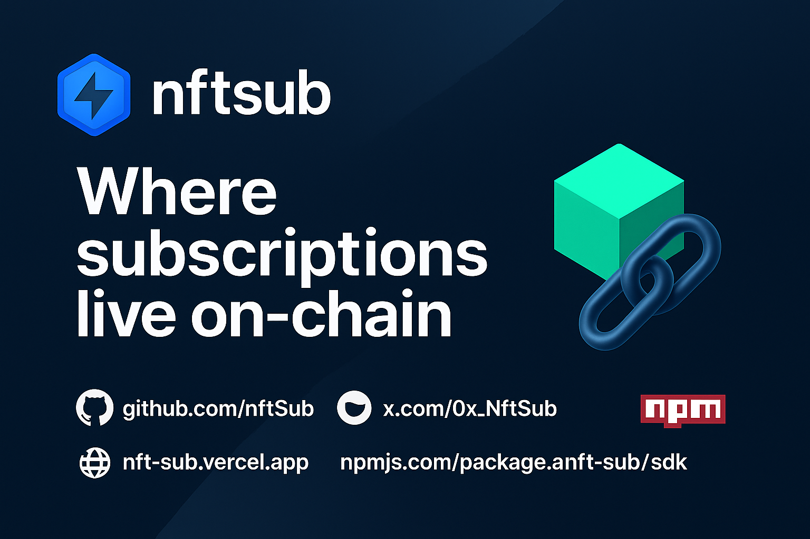

<div align="center">
  
  
  # nftSub Smart Contracts
  
  ERC-1155 based subscription NFT contracts with Reactive Network automation for Web3 subscription management.
</div>


 

## Overview

nftSub Smart Contracts provide the foundational layer for decentralized subscription services on EVM. The system consists of three main contracts working in harmony to enable subscription-based access control through NFTs.

## Related Projects

- [nftSub SDK](../nftSub-sdk/) - TypeScript SDK for integrating with these contracts
- [nftSub Frontend](../nftSub-frontend/) - Documentation site and interactive demos

## Architecture

### Core Contracts

#### SubscriptionManager.sol
Handles subscription payments and merchant management.
- Register and manage merchants
- Process subscription payments (ETH & ERC-20)
- Configure pricing and subscription terms
- Withdraw merchant balances
- Platform fee management

#### SubscriptionNFT.sol  
ERC-1155 NFT contract for subscription tokens.
- Mint subscription NFTs on payment
- Track subscription expiry and renewals
- Enable NFT transfers and trading
- Provide access control mechanisms
- Integration with Reactive Network

#### SubscriptionReactive.sol
Reactive Network automation contract.
- Monitor payment events across chains
- Automatic subscription renewal processing
- Hourly expiry checks via CRON
- Cross-chain callback execution

## 🚀 Mainnet Deployments

We are **LIVE ON MAINNET** across multiple chains! All contracts use the same addresses thanks to CREATE2 deployment.

### Destination Chains

| Chain | SubscriptionManager | SubscriptionNFT | Explorer |
|-------|---------------------|-----------------|----------|
| **Base** | [`0x99ad42b29a7a99Ee4552cf6dc36dc4d44d8b0A2c`](https://basescan.org/address/0x99ad42b29a7a99Ee4552cf6dc36dc4d44d8b0A2c) | [`0x6D4b8BC4613dDCB98450a97b297294BacBd2DDD8`](https://basescan.org/address/0x6D4b8BC4613dDCB98450a97b297294BacBd2DDD8) | [BaseScan](https://basescan.org) |
| **BSC** | [`0x99ad42b29a7a99Ee4552cf6dc36dc4d44d8b0A2c`](https://bscscan.com/address/0x99ad42b29a7a99Ee4552cf6dc36dc4d44d8b0A2c) | [`0x6D4b8BC4613dDCB98450a97b297294BacBd2DDD8`](https://bscscan.com/address/0x6D4b8BC4613dDCB98450a97b297294BacBd2DDD8) | [BscScan](https://bscscan.com) |
| **Avalanche** | [`0x99ad42b29a7a99Ee4552cf6dc36dc4d44d8b0A2c`](https://snowtrace.io/address/0x99ad42b29a7a99Ee4552cf6dc36dc4d44d8b0A2c) | [`0x6D4b8BC4613dDCB98450a97b297294BacBd2DDD8`](https://snowtrace.io/address/0x6D4b8BC4613dDCB98450a97b297294BacBd2DDD8) | [SnowTrace](https://snowtrace.io) |
| **Sonic** | [`0x99ad42b29a7a99Ee4552cf6dc36dc4d44d8b0A2c`](https://sonicscan.org/address/0x99ad42b29a7a99Ee4552cf6dc36dc4d44d8b0A2c) | [`0x6D4b8BC4613dDCB98450a97b297294BacBd2DDD8`](https://sonicscan.org/address/0x6D4b8BC4613dDCB98450a97b297294BacBd2DDD8) | [SonicScan](https://sonicscan.org) |

### Reactive Network (Mainnet)

| Contract | Address | Explorer |
|----------|---------|----------|
| **SubscriptionReactive** | [`0x99ad42b29a7a99Ee4552cf6dc36dc4d44d8b0A2c`](https://reactscan.net/address/0x99ad42b29a7a99Ee4552cf6dc36dc4d44d8b0A2c) | [ReactScan](https://reactscan.net) |

The Reactive contract monitors all destination chains for payment events and handles automatic renewals.

## Testnet Deployments (Sepolia)

| Contract | Address |
|----------|---------|
| SubscriptionManager | `0x82b069578ae3dA9ea740D24934334208b83E530E` |
| SubscriptionNFT | `0x404cb817FA393D3689D1405DB0B76a20eDE72d43` |
| SubscriptionReactive | `0xa55B7A74D05b5D5C48E431e44Fea83a1047A7582` |
| TestToken (SUBTEST) | `0x10586EBF2Ce1F3e851a8F15659cBa15b03Eb8B8A` |

## Installation

```bash
# Clone the repository
git clone <repository-url>
cd subscription-nft-contract

# Install dependencies
forge install

# Build contracts
forge build
```

## Development

### Testing
```bash
# Run all tests
forge test

# Run with verbosity
forge test -vvv

# Run specific test
forge test --match-test testSubscribe

# Gas reports
forge test --gas-report
```

### Local Deployment
```bash
# Start local node
anvil

# Deploy to local
forge script script/Deploy.s.sol --rpc-url http://localhost:8545 --broadcast
```

### Testnet Deployment
```bash
# Deploy to Sepolia
forge script script/Deploy.s.sol \
  --rpc-url $SEPOLIA_RPC_URL \
  --private-key $PRIVATE_KEY \
  --broadcast \
  --verify
```

## Contract Interactions

### Register as Merchant
```solidity
// Register with 30-day subscription, 7-day grace period
subscriptionManager.registerMerchant(
    merchantAddress,
    2592000, // 30 days in seconds
    604800   // 7 days grace period
);
```

### Set Subscription Price
```solidity
// Set price to 0.01 ETH
subscriptionManager.setMerchantPrice(
    merchantId,
    address(0), // ETH
    0.01 ether
);
```

### Subscribe to Service
```solidity
// Subscribe with ETH
subscriptionManager.subscribe{value: price}(
    merchantId,
    address(0) // ETH
);

// Subscribe with ERC-20
token.approve(subscriptionManager, price);
subscriptionManager.subscribe(merchantId, tokenAddress);
```

### Check Access
```solidity
bool hasAccess = subscriptionNFT.isSubscriptionActive(
    userAddress,
    merchantId
);
```

## Key Features

### Multi-Token Support
- ETH payments (native)
- ERC-20 token payments
- Configurable per-merchant pricing

### Automated Management
- Reactive Network integration
- Automatic renewal processing
- Hourly expiry checks
- Cross-chain event monitoring

### Access Control
- Role-based permissions
- Merchant self-management
- Platform admin controls
- Reactive contract privileges

### NFT Functionality
- ERC-1155 standard compliance
- Transferable subscriptions
- Metadata support
- Batch operations

## Security Features

- Reentrancy guards on payment functions
- Role-based access control (RBAC)
- Safe transfer mechanisms
- Pausable functionality
- Merchant balance isolation

## Gas Optimization

- Batch operations for multiple subscriptions
- Efficient storage patterns
- Minimal external calls
- Optimized event emissions

## Testing

The contracts include comprehensive test coverage:
- Unit tests for all functions
- Integration tests for payment flows
- Fork tests for mainnet interactions
- Gas optimization tests

```bash
forge coverage
```

## Verification

Verify deployed contracts:
```bash
# Verify SubscriptionManager
forge verify-contract \
  --chain-id 11155111 \
  --compiler-version v0.8.19 \
  0x82b069578ae3dA9ea740D24934334208b83E530E \
  src/SubscriptionManager.sol:SubscriptionManager

# Check deployment
cast code 0x82b069578ae3dA9ea740D24934334208b83E530E --rpc-url $SEPOLIA_RPC_URL
```

## License

MIT

## Resources

- [Reactive Network Documentation](https://docs.reactive.network/)
- [Foundry Documentation](https://book.getfoundry.sh/)
- [ERC-1155 Standard](https://eips.ethereum.org/EIPS/eip-1155)
- [OpenZeppelin Contracts](https://docs.openzeppelin.com/)